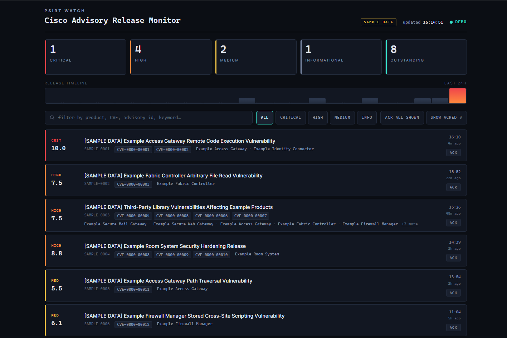

# PSIRT Watch - Cisco advisory release monitor

Keeping on top of vendor security advisories is routine but important operational
work: missing a critical advisory means finding out about an exposed system the
hard way. This project automates that watch, polling Cisco's public openVuln API,
flagging new advisories as they land, and giving a support or security team an
at-a-glance view of what is outstanding.

A watch-wall page shows Cisco Security Advisories as they're released, flags
new ones the moment a batch lands, and gives severity counts plus a 24h release
timeline. The browser never touches the Cisco API; a small Python poller holds
the credentials and writes `advisories.json`, which the page reads and refreshes.

```
psirt_fetch.py  --OAuth2-->  Cisco openVuln API  -->  advisories.json  <--  dashboard.html
```

## Screenshots



## 1. Get API credentials
Register an app on the Cisco API Console (apiconsole.cisco.com) with your CCO ID,
grant type **Client Credentials**. You'll get a Client ID and Client Secret.

## 2. Run the poller
```bash
export CISCO_CLIENT_ID=xxxxxxxx
export CISCO_CLIENT_SECRET=xxxxxxxx

# loop, poll every 30s (default), write ./advisories.json
python3 psirt_fetch.py

# or a single pull for cron / systemd timer
python3 psirt_fetch.py --once --out /var/www/psirt/advisories.json
```
Modes:
- `--mode latest --latest 200` - the newest N advisories (default, best for a live dump watch)
- `--mode firstpublished --start 2026-07-28 --end 2026-07-28` - everything published in a date window
- `--mode severity --severity critical` - filter server-side by SIR

Stdlib only, no `pip install` needed.

## 3. Serve the page
`dashboard.html` and `advisories.json` must sit in the same directory so the
page's `fetch('./advisories.json')` resolves.
```bash
cd /path/with/both/files
python3 -m http.server 8080
# open http://<your-box>:8080/dashboard.html
```
Opening the HTML file directly (file://) will fail the fetch; serve it over HTTP.
Until it finds a real `advisories.json`, the page shows built-in **sample data**
(obviously fictional IDs and CVEs, marked with a yellow "SAMPLE DATA" tag) so you
can see the layout without mistaking it for a genuine advisory feed.

## Using the dashboard
- **Summary tiles** - Critical / High / Medium / Informational / Outstanding counts.
  These count only advisories you haven't acknowledged yet (see below), so the
  tiles reflect open work, not the full feed.
- **Release timeline** - a 24h bar chart of when advisories landed, for spotting
  batch drops (e.g. a monthly bundle).
- **Search + severity filters** - free-text over title / advisory id / CVEs /
  products, plus buttons to narrow to one severity. Both apply on top of the
  ack filter below.
- **NEW badge** - an advisory not seen on a previous poll gets a "NEW" badge and
  a highlight animation the first time it renders.

## Acknowledging advisories
Each row has an **Ack** button; there's also **Ack all shown** (acks everything
passing the current search/severity filter) and a **Show acked** toggle to bring
hidden rows back into view. Acknowledged advisories are hidden from the feed and
excluded from the summary tiles until you toggle them back on.

State is per-browser, stored in `localStorage` under `psirt_acked_v1` as a list
of `advisoryId@version` keys. Nothing is sent to a server, so acks don't sync
between devices.

## Baseline mode (`?baseline`)
Opening the page as `dashboard.html?baseline` on a browser that's never been
baselined acknowledges every advisory present in the *first successfully
fetched* `advisories.json`, so the panel starts empty and only advisories
published after that point show up. This is meant for a first-time watch-wall
setup where you don't want to be greeted by months of backlog.

Notes:
- It only ever baselines against real fetched data, never against the
  built-in sample fallback, so a slow or unreachable `advisories.json` on
  first load can't poison the baseline with sample IDs.
- It's a one-time action per browser, tracked via `localStorage`
  (`psirt_baselined_v1`). Reloading with `?baseline` again is a no-op; it
  won't re-baseline or un-ack anything.
- To re-run it, clear `psirt_baselined_v1` (and typically `psirt_acked_v1`)
  from DevTools, Application, Local Storage.

## Tuning
- Poll cadence: `REFRESH_MS` at the top of the `<script>` in `dashboard.html`
  (default 30s), match it to how fast you want new advisories to surface.
- Poller interval: `--interval` (keep it courteous; the openVuln API is rate-limited).
- Filter box takes product / CVE / advisory-id / keyword, so when the batch lands
  you can narrow straight to whatever it turns out to involve.

## systemd timer (optional, instead of the loop)
`psirt-fetch.service` (Type=oneshot running `--once`) plus `psirt-fetch.timer`
(`OnUnitActiveSec=30s`) keeps it running without a long-lived process, with the
credentials in the service's `Environment=` or an `EnvironmentFile=`.

`deploy.sh` installs both the poller and dashboard as systemd services on an
Ubuntu box: it copies the project files, creates a credentials file at
`psirt.env` (600 permissions, empty placeholders you fill in by hand) and
generates the unit files for the current user and directory.

## Design decisions
- **Stdlib only.** `psirt_fetch.py` uses nothing beyond the Python standard
  library: no `pip install`, no dependency drift, easy to drop onto any box
  that has Python 3.
- **OAuth2 client credentials.** The poller is a machine-to-machine client, so
  it authenticates with Cisco's OAuth2 client credentials grant rather than a
  user login, caching the bearer token and refreshing it shortly before expiry.
- **Polling interval.** There's no webhook or push feed for openVuln, so the
  poller works on a short interval (default 30s) with a `--once` mode for
  cron/systemd timers, and keeps the interval courteous to stay within the
  API's rate limits.
- **Ack and baseline tracking.** Both live in the browser's `localStorage`
  rather than a server-side database, so there's nothing to deploy or back up
  for state that's genuinely per-viewer and per-device.
- **Runs as systemd services.** `deploy.sh` is written for a small always-on
  Ubuntu box: one service for the poller, one for the static dashboard server,
  both restarting on failure.

This project was built with AI-assisted tooling (Claude Code).

## Licence
MIT. See [LICENSE](LICENSE).
